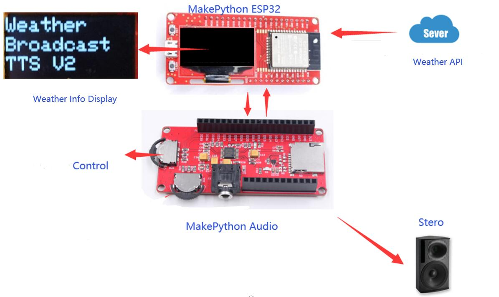

# MicroPython TTS Weather broadcast

```c++
/*
Version:		V2.0
Author:			Vincent
Create Date:	2020/7/1
Note:
	2020/8/3 V2:
	1,Python's TTS is a local operation, with poor effect. This version realizes voice broadcasting through arduino's TTS service of acquiring Google cloud.
	2,3D printing shells designed for MakePython ESP32 and MakePython Audio are provided.
	3,The code was completely refacted. The previous README was renamed to oldVersion_v1_readme.
*/
```
[youtube:TTS-Weather-Broadcast](https://youtu.be/00nAEQKYFV4)


[toc]


# OVERVIEW

## Intruduce

[Makerfabs home page](https://www.makerfabs.com/)

[Makerfabs Wiki](https://makerfabs.com/wiki/index.php?title=Main_Page)

Through the MicroPython TTS text-to-speech module, the weather API on the network can be acquired through wifi, and the real-time weather can be broadcast by voice. Download the code and connect with the stereo, you will get a customized intelligent weather announcer!




## Equipment list

- [MakePython ESP32](https://www.makerfabs.com/wiki/index.php?title=MakePython_ESP32)
- [MakaPython Audio](https://www.makerfabs.com/wiki/index.php?title=MakaPython_Audio)
- Audio/headphones with 3.5mm audio connector
- Wi-fi routers

# STEPS

## Prepare And Burn

**If you have any questions，such as how to install the development board, how to download the code, how to install the library. Please refer to :[Makerfabs_FAQ](https://github.com/Makerfabs/Makerfabs_FAQ)**

- Install board : esp32 .
- Install library : Adafruit SSD1306 and dependent libraries.
- Install zip library : [ESP32-audioI2S](https://github.com/schreibfaul1/ESP32-audioI2S)("Audio.h")
- Open file "Project_TTS-Weather-Broadcast/WeatherBroadcast_V2/WeatherBroadcast_V2.ino"

- Change the time WiFi ssid and password.

```c++
//WIFI
const char *ssid = "Makerfabs";
const char *password = "20160704";
```

- Upload to esp32.


- **~~ATTENTION !!! Plug ESP32 and Audio expansion boards together after burning. Be sure to plug them together after burning or the firmware will not burn.~~** 
- **V1.1 Add:	MicroPython Audio can be downloaded without unplugging. When uploading the program, please rotate the switch next to the 3.5mm Audio interface to the Audio socket.**


- Plug the stereo or earphone into a 3.5mm audio jack.

## How to use TTS Weather broadcast

- Set Wifi password.
- Press MUTE and the screen reacts to the weather. Wait a few seconds for the voice to announce the weather.
- Lower side switch, left and right for next song, Previous.Press inward to pause.
- The switch on the left, volume up and down.Press in to mute.


# How to get a weather API?

Different regions may have different network restrictions. Since I can't run VPN on ESP32, and I don't have a wireless router with this function, I can't use API like Google, so I chose a local Weather API provider in China:

## [heweather](https://github.com/heweather)

You can on Google looking for a fee or free API interface, most of time limits or individual users with a number of free API interface. The remaining is according to the use of API tutorial, generally is registered, choose the required interface, and then give you a key used to access the service chamber of commerce. After can replace your url and analytic function in this project.

I don't guarantee that the interface will be accessible by the time you see this, so it's best to simply replace the API you know you can use and modify the parse_HTML () function in weather.py to parse it properly.

This is a reponse example:

```c++
{
    "HeWeather6":[
        {
            "basic":{
                "cid":"CN101280601",
                "location":"Shenzhen",
                "parent_city":"Shenzhen",
                "admin_area":"Guangdong",
                "cnty":"China",
                "lat":"22.54700089",
                "lon":"114.08594513",
                "tz":"+8.00"
            },
            "update":{
                "loc":"2020-08-03 10:12",
                "utc":"2020-08-03 02:12"
            },
            "status":"ok",
            "now":{
                "cloud":"97",
                "cond_code":"399",
                "cond_txt":"Rain",
                "fl":"30",
                "hum":"97",
                "pcpn":"1.0",
                "pres":"997",
                "tmp":"26",
                "vis":"6",
                "wind_deg":"183",
                "wind_dir":"S",
                "wind_sc":"2",
                "wind_spd":"6"
            }
        }
    ]
}
```

# 3D Printer Box

We designed a simple 3D-printed case. Don't need support.

[STL File](https://github.com/Makerfabs/Project_MakePython_Audio_Music/)


